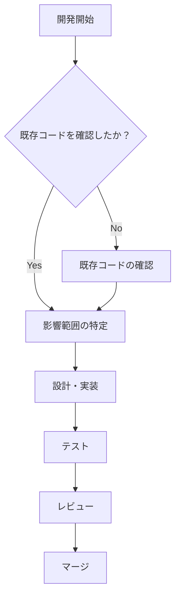

# 🚨 MLB Data Analysis - 開発ガイドライン

## 🔴 **最重要ルール: コードを書く前に既存コードを確認せよ**

このドキュメントは、プロジェクトの一貫性と品質を保つための**絶対的なルール**です。

---

## 📋 **開発フロー**

### 1️⃣ **新機能開発・バグ修正を始める前に**



### 2️⃣ **既存コード確認チェックリスト**

#### **必須確認項目**
- [ ] メインロジック (`mlb_complete_report_real.py`)
- [ ] API クライアント (`mlb_api_client.py`)
- [ ] 関連するスクリプト (`convert_to_html.py`, `fetch_all_mlb_pitchers.py`)
- [ ] キャッシュ構造 (`cache/pitcher_info/`)
- [ ] 設定ファイル (`requirements.txt`, `.github/workflows/`)

---

## 🤖 **AIアシスタント（Claude/ChatGPT等）活用ガイド**

### **テンプレート1: 新機能追加**

```markdown
## 新機能追加リクエスト

### 既存コードの確認
以下のファイルを確認してください：
- https://raw.githubusercontent.com/KIYUKIYUKIYU/mlb-data-analysis/main/scripts/mlb_complete_report_real.py
- https://raw.githubusercontent.com/KIYUKIYUKIYU/mlb-data-analysis/main/src/mlb_api_client.py

### 追加したい機能
[機能の詳細説明]

### 制約事項
1. 既存のデータ構造を変更しない
2. 既存の関数シグネチャを維持
3. エラーハンドリングパターンを統一
4. ログ出力形式を既存と合わせる

### 期待する出力
- 既存コードとの整合性が取れたコード
- 影響を受ける他のファイルのリスト
- 必要な追加テスト
```

### **テンプレート2: バグ修正**

```markdown
## バグ修正リクエスト

### 問題の説明
[具体的な問題と再現手順]

### 関連コードの確認
以下のコードを確認してください：
[関連コードを貼り付け、またはGitHub URLを提供]

### 修正方針
- 根本原因の特定
- 最小限の変更で修正
- 副作用の確認

### 確認事項
- 他の機能への影響はあるか？
- キャッシュのクリアは必要か？
- 設定変更は必要か？
```

### **テンプレート3: リファクタリング**

```markdown
## リファクタリングリクエスト

### 現在のコード構造
[既存コードのURL または 貼り付け]

### リファクタリングの目的
- [ ] パフォーマンス改善
- [ ] 可読性向上
- [ ] モジュール化
- [ ] テスタビリティ向上

### 制約事項
1. 外部インターフェース（関数の引数・戻り値）を変更しない
2. 既存のキャッシュ形式を維持
3. ログ出力を保持

### 段階的な実装計画
1. Phase 1: [最初の変更]
2. Phase 2: [次の変更]
3. Phase 3: [最終的な変更]
```

---

## 📝 **コーディング規約**

### **命名規則**

```python
# クラス名: PascalCase
class MLBApiClient:
    pass

# 関数名: snake_case
def fetch_pitcher_info(player_id):
    pass

# 定数: UPPER_SNAKE_CASE
MAX_RETRY_COUNT = 3
API_BASE_URL = "https://statsapi.mlb.com/api/v1/"

# プライベート関数: 先頭にアンダースコア
def _calculate_internal_metric(data):
    pass
```

### **データ構造の規約**

```python
# 投手データの標準形式（変更禁止）
pitcher_data = {
    "player_id": int,
    "name": str,
    "team": str,
    "pitchHand": str,  # "L" or "R"
    "stats": {
        "era": float,
        "fip": float,
        "xfip": float,
        "whip": float,
        "k_bb_percent": float,
        "gb_percent": float,
        "fb_percent": float,
        "swstr_percent": float,
        "babip": float
    },
    "splits": {
        "vs_left": {"avg": float, "ops": float},
        "vs_right": {"avg": float, "ops": float}
    },
    "last_updated": str  # ISO format
}

# レポートヘッダーの形式（変更禁止）
REPORT_HEADER = """
============================================================
MLB試合予想レポート - 日本時間 {date} の試合
============================================================
{reliability_level} データ信頼性: {status} ({score}データが本日更新) | {time}時点
------------------------------------------------------------
"""
```

### **エラーハンドリング**

```python
# 標準的なエラーハンドリングパターン
def fetch_data(url):
    try:
        response = requests.get(url, timeout=10)
        response.raise_for_status()
        return response.json()
    except requests.exceptions.Timeout:
        logger.error(f"Timeout accessing {url}")
        return None
    except requests.exceptions.RequestException as e:
        logger.error(f"Error fetching data from {url}: {e}")
        return None
    except json.JSONDecodeError as e:
        logger.error(f"Invalid JSON response from {url}: {e}")
        return None
```

### **ログ出力**

```python
import logging

# ログ設定（既存形式を維持）
logging.basicConfig(
    level=logging.INFO,
    format='%(asctime)s - %(name)s - %(levelname)s - %(message)s'
)

logger = logging.getLogger(__name__)

# ログレベルの使い分け
logger.debug("詳細なデバッグ情報")
logger.info("正常な処理フロー")
logger.warning("警告（処理は継続）")
logger.error("エラー（リトライ可能）")
logger.critical("致命的エラー（処理停止）")
```

---

## 🧪 **テスト方針**

### **ローカルテスト実行手順**

```bash
# 1. 単体機能テスト
python scripts/mlb_complete_report_real.py --date 2025-08-25

# 2. HTML変換テスト
python scripts/convert_to_html.py "daily_reports/test.txt"

# 3. キャッシュ動作確認
python scripts/fetch_all_mlb_pitchers.py --limit 10

# 4. API接続テスト
python -c "from src.mlb_api_client import MLBApiClient; client = MLBApiClient(); print(client.get_schedule('2025-08-25'))"
```

### **チェック項目**

- [ ] エラーなく実行完了
- [ ] ログが適切に出力
- [ ] キャッシュが正しく更新
- [ ] 出力ファイルが生成
- [ ] データの整合性確認

---

## 🔄 **Git ワークフロー**

### **ブランチ戦略**

```bash
main                 # 本番環境
├── develop         # 開発統合ブランチ
    ├── feature/*   # 新機能開発
    ├── bugfix/*    # バグ修正
    └── refactor/*  # リファクタリング
```

### **コミットメッセージ規約**

```bash
# 形式: <type>: <subject>

feat: FanGraphs API統合を追加
fix: データ更新カウントのバグを修正
refactor: MLBApiClientクラスをモジュール化
docs: README.mdを更新
test: 投手データ取得のテストを追加
chore: 依存パッケージを更新
```

### **プルリクエストテンプレート**

```markdown
## 変更内容
- 何を変更したか

## 変更理由
- なぜ変更が必要か

## 確認済み項目
- [ ] 既存コードを確認した
- [ ] ローカルテストを実行した
- [ ] 影響範囲を特定した
- [ ] ドキュメントを更新した

## 関連Issue
- #123

## スクリーンショット（該当する場合）
- 変更前後の画面
```

---

## 📊 **データ更新フロー**

### **キャッシュ更新タイミング**

```python
# キャッシュの有効期限チェック
def is_cache_valid(cache_file, ttl_hours=24):
    if not cache_file.exists():
        return False
    
    mod_time = datetime.fromtimestamp(cache_file.stat().st_mtime)
    age_hours = (datetime.now() - mod_time).total_seconds() / 3600
    
    return age_hours < ttl_hours
```

### **データソース優先順位**

1. **キャッシュ** (24時間以内)
2. **MLB Stats API** (リアルタイム)
3. **FanGraphs** (日次更新)
4. **フォールバック値** (デフォルト)

---

## 🚫 **やってはいけないこと**

### **絶対にやってはいけない**
- ❌ 既存コードを確認せずに新機能を追加
- ❌ データ構造を勝手に変更
- ❌ エラーハンドリングなしでAPIを呼び出し
- ❌ ログを出力せずに重要な処理を実行
- ❌ テストなしで本番環境にデプロイ

### **避けるべきこと**
- ⚠️ 巨大な関数（100行以上）
- ⚠️ マジックナンバーの使用
- ⚠️ グローバル変数の乱用
- ⚠️ 同期的な大量API呼び出し
- ⚠️ キャッシュの無効化忘れ

---

## 📚 **参考資料**

### **内部ドキュメント**
- [README.md](README.md) - プロジェクト概要
- [API_REFERENCE.md](API_REFERENCE.md) - API仕様書（作成予定）
- [TROUBLESHOOTING.md](TROUBLESHOOTING.md) - トラブルシューティング（作成予定）

### **外部リソース**
- [MLB Stats API Documentation](https://statsapi.mlb.com/docs/)
- [Python Style Guide (PEP 8)](https://www.python.org/dev/peps/pep-0008/)
- [GitHub Flow](https://guides.github.com/introduction/flow/)

---

## 🔍 **デバッグ手順**

### **問題が発生したら**

1. **ログを確認**
   ```bash
   tail -f daily_reports/debug.log
   ```

2. **キャッシュをクリア**
   ```bash
   rm -rf cache/pitcher_info/*
   ```

3. **単独実行でテスト**
   ```python
   python -c "from src.mlb_api_client import MLBApiClient; print(MLBApiClient().get_schedule())"
   ```

4. **環境変数を確認**
   ```bash
   echo $GOOGLE_CREDENTIALS
   echo $GOOGLE_DRIVE_FOLDER_ID
   ```

---

## ✅ **最終チェックリスト**

コードをコミットする前に：

- [ ] **既存コードを確認した**
- [ ] 命名規則に従っている
- [ ] エラーハンドリングを実装した
- [ ] ログを適切に出力している
- [ ] データ構造を維持している
- [ ] テストを実行した
- [ ] ドキュメントを更新した
- [ ] コミットメッセージが規約に従っている

---

**このガイドラインは生きたドキュメントです。プロジェクトの成長に合わせて更新してください。**

最終更新: 2025年8月25日

